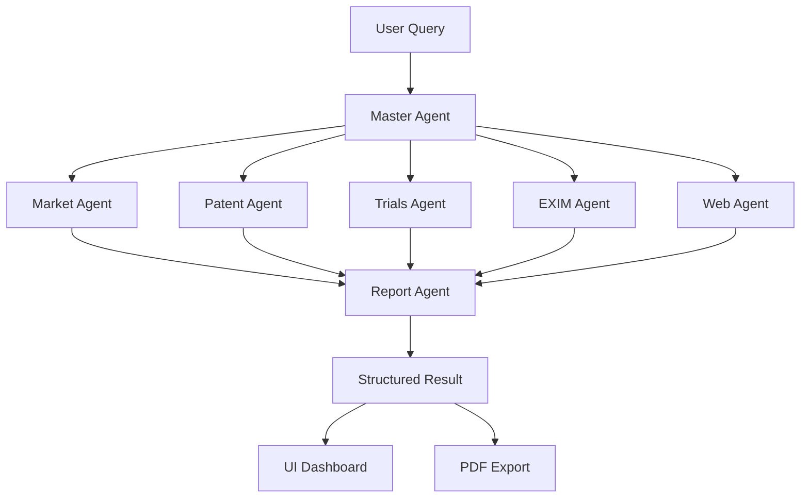

<div align="center">

# 🧬 MoleculeX

### AI-Powered Pharmaceutical Intelligence Platform

*Revolutionizing drug development with multi-agent AI orchestration*

[](https://www.typescriptlang.org/)
[](https://reactjs.org/)
[](https://vitejs.dev/)
[](https://ai.google.dev/)

[Demo](#demo) • [Features](#features) • [Installation](#installation) • [Usage](#usage) • [Architecture](#architecture)

</div>

---

## 📋 Overview

**MoleculeX** is an advanced pharmaceutical intelligence platform that leverages Google's Gemini AI and a multi-agent orchestration system to provide comprehensive market analysis, patent intelligence, clinical trial tracking, and competitive insights for drug development.

### 🎯 Problem Statement

Pharmaceutical companies need to analyze vast amounts of data across multiple domains (market trends, patents, clinical trials, trade data) to make informed strategic decisions. Traditional research methods are:
- ⏱️ Time-consuming and labor-intensive
- 💰 Expensive requiring multiple specialized analysts
- 🔍 Often incomplete or siloed across departments
- 📊 Difficult to synthesize into actionable insights

### 💡 Solution

MoleculeX automates pharmaceutical intelligence gathering using specialized AI agents that work in parallel to:
- Analyze market size, CAGR, and competitive landscapes
- Track patent portfolios and identify IP opportunities
- Monitor clinical trial pipelines across therapeutic areas
- Evaluate import/export trends and trade patterns
- Generate strategic SWOT analysis and opportunity scores

---

## ✨ Features

### 🤖 Multi-Agent AI System
- **Master Agent**: Orchestrates the entire intelligence gathering workflow
- **Market Agent**: Analyzes market size, growth rates, and key competitors
- **Patent Agent**: Tracks patent portfolios, expiry dates, and IP landscapes
- **Clinical Trials Agent**: Monitors ongoing trials, phases, sponsors, and enrollment
- **EXIM Agent**: Evaluates import/export volumes and trade patterns
- **Web Agent**: Gathers competitive intelligence and industry insights
- **Report Agent**: Synthesizes all data into structured intelligence reports

### 📊 Advanced Analytics
- **Interactive Dashboards**: Real-time data visualization with Recharts
- **Market Growth Projections**: Historical and forecasted market trends
- **Patent Timeline Visualization**: Track patent expiries and opportunities
- **Clinical Trial Phase Distribution**: Donut charts showing trial pipeline
- **Competitive Landscape Matrix**: 2x2 grid mapping market share vs innovation
- **SWOT Analysis**: Strategic strengths, weaknesses, opportunities, and threats

### 🎨 Modern UI/UX
- **Dark/Light Mode**: Seamless theme switching with smooth transitions
- **Responsive Design**: Works flawlessly on desktop, tablet, and mobile
- **Real-time Agent Status**: Live monitoring of AI agent progress
- **Beautiful Landing Page**: Professional onboarding experience
- **Interactive Charts**: Hover effects, tooltips, and drill-down capabilities

### 🔐 Smart API Management
- **Quota Limit Handling**: Automatic detection of API quota exhaustion
- **On-the-Fly API Key Switching**: Enter new keys without restarting
- **Graceful Error Recovery**: Continue processing with alternative credentials
- **Secure Key Storage**: Environment-based configuration

### 📄 Export & Reporting
- **PDF Generation**: Professional reports with tables and analysis
- **Structured JSON Export**: Programmatic access to all intelligence data
- **Source Attribution**: Traceable references for all findings

---

## 🚀 Installation

### Prerequisites

- **Node.js** (v18 or higher)
- **npm** or **yarn**
- **Gemini API Key** ([Get one here](https://aistudio.google.com/app/apikey))

### Setup Steps

1. **Clone the repository**
   ```bash
   git clone https://github.com/Abhishekmishra2808/molecule.git
   cd molecule
   ```

2. **Install dependencies**
   ```bash
   npm install
   ```

3. **Configure environment variables**
   
   Create a `.env.local` file in the root directory:
   ```env
   GEMINI_API_KEY=your_gemini_api_key_here
   ```

4. **Start the development server**
   ```bash
   npm run dev
   ```

5. **Open your browser**
   
   Navigate to `http://localhost:3000`

---

## 💻 Usage

### Basic Workflow

1. **Landing Page**: Click "Get Started" to enter the application
2. **Research Setup**: 
   - Enter your research question (e.g., "What are the emerging opportunities in cardiovascular drug development in Asia?")
   - Select region (Asia, USA, Europe, Global, India)
   - Optionally specify a molecule name
   - Enable/disable PDF report generation
3. **Run Orchestration**: Click the button to start AI analysis
4. **Monitor Progress**: Watch agents execute in real-time
5. **View Results**: Explore insights across Market, Clinical, IP, EXIM, and Strategy tabs
6. **Download Report**: Export comprehensive PDF analysis

### Handling Quota Limits

If you encounter a Gemini API quota limit:
1. A modal will automatically appear
2. Enter a new API key from [Google AI Studio](https://aistudio.google.com/app/apikey)
3. Click "Retry with New Key"
4. Processing continues seamlessly

### Sample Queries

```
What are the emerging opportunities in cardiovascular drug development in Asia?
Analyze the biosimilar landscape for oncology drugs in Europe
What is the patent cliff risk for diabetes medications in the USA?
Evaluate clinical trial activity for mRNA vaccines globally
```

---

## 🏗️ Architecture

### Tech Stack

**Frontend**
- React 19 with TypeScript
- Vite for blazing-fast builds
- Tailwind CSS for styling
- Lucide React for icons
- Recharts for data visualization

**AI & Backend**
- Google Gemini 2.5 Flash (via `@google/genai`)
- Multi-agent orchestration system
- Real-time status polling
- Sequential agent execution with fault tolerance

**Export & Reporting**
- jsPDF for PDF generation
- jsPDF-AutoTable for structured tables
- JSON structured output

### Project Structure

```
molecule/
├── components/
│   ├── AgentPanel.tsx       # Agent status monitoring
│   ├── Charts.tsx            # Data visualization components
│   ├── ChatPanel.tsx         # System logs display
│   ├── LandingPage.tsx       # Welcome screen
│   └── ResultCards.tsx       # Intelligence cards & SWOT
├── services/
│   └── api.ts                # Gemini API integration & orchestration
├── App.tsx                   # Main application component
├── types.ts                  # TypeScript interfaces
├── index.tsx                 # Application entry point
├── package.json              # Dependencies
├── vite.config.ts            # Build configuration
└── .env.local                # Environment variables (not in git)
```

### Multi-Agent Orchestration Flow



---

## 🎨 Screenshots

### Landing Page
Beautiful, professional landing page with smooth animations and gradient effects.

### Main Dashboard
Real-time agent monitoring, research setup panel, and comprehensive data tabs.

### Market Analysis
Interactive bar charts showing market growth projections with key metrics cards.

### Clinical Trials
Donut chart visualization of trial phases with detailed trial listings.

### Patent Timeline
Horizontal bar chart showing patent expiries with remaining years indicators.

### Competitive Landscape
Scatter plot matrix mapping competitors by market share and innovation scores.

---

## 🔧 Configuration

### Environment Variables

| Variable | Description | Required |
|----------|-------------|----------|
| `GEMINI_API_KEY` | Your Google Gemini API key | Yes |

### Customization

**Theme Colors**: Modify `tailwind.config.js` (if present) or CSS variables in `index.css`

**AI Models**: Update model names in `services/api.ts`:
```typescript
const modelSearch = 'gemini-2.5-flash';
const modelReasoning = 'gemini-2.5-flash';
```

**Delay Between API Calls**: Adjust in `services/api.ts`:
```typescript
const SAFE_DELAY_MS = 15000; // 15 seconds
```

---

## 🐛 Troubleshooting

### Common Issues

**Issue**: "Quota limit exceeded" error
- **Solution**: Use the API key modal to enter a new Gemini API key

**Issue**: Charts not rendering properly
- **Solution**: Ensure all data fields are populated; check browser console for errors

**Issue**: Build fails with TypeScript errors
- **Solution**: Run `npm install` to ensure all type definitions are installed

**Issue**: Vite server won't start
- **Solution**: Check if port 3000 is available or change port in `vite.config.ts`

---

## 🚢 Deployment

### Build for Production

```bash
npm run build
```

This creates an optimized production build in the `dist/` folder.

### Deploy to Vercel

```bash
# Install Vercel CLI
npm i -g vercel

# Deploy
vercel
```

### Deploy to Netlify

1. Connect your GitHub repository to Netlify
2. Set build command: `npm run build`
3. Set publish directory: `dist`
4. Add environment variable: `GEMINI_API_KEY`

---

## 🤝 Contributing

Contributions are welcome! Please follow these steps:

1. Fork the repository
2. Create a feature branch (`git checkout -b feature/AmazingFeature`)
3. Commit your changes (`git commit -m 'Add some AmazingFeature'`)
4. Push to the branch (`git push origin feature/AmazingFeature`)
5. Open a Pull Request

---

## 📄 License

This project is licensed under the MIT License - see the LICENSE file for details.

---

## 👨‍💻 Author

**Abhishek Mishra**

- GitHub: [@Abhishekmishra2808](https://github.com/Abhishekmishra2808)
- LinkedIn: [Connect with me](https://linkedin.com/in/abhishek-mishra)

---

## 🙏 Acknowledgments

- [Google Gemini](https://ai.google.dev/) for powerful AI capabilities
- [Recharts](https://recharts.org/) for beautiful chart components
- [Lucide](https://lucide.dev/) for clean, consistent icons
- [Tailwind CSS](https://tailwindcss.com/) for utility-first styling
- The pharmaceutical research community for inspiration

---

## 📊 Project Status

**Current Version**: 2.5.0  
**Status**: ✅ Active Development  
**Last Updated**: December 2025

### Roadmap

- [ ] Add real-time web search integration
- [ ] Implement user authentication and saved queries
- [ ] Add comparison mode for multiple molecules
- [ ] Integrate with additional data sources (FDA, EMA)
- [ ] Add collaborative features for team research
- [ ] Implement API rate limiting dashboard
- [ ] Add export to Excel/CSV functionality

---

<div align="center">

**⭐ Star this repo if you find it helpful!**

Made with ❤️ for the pharmaceutical research community

[Report Bug](https://github.com/Abhishekmishra2808/molecule/issues) • [Request Feature](https://github.com/Abhishekmishra2808/molecule/issues)

</div>
